# {.tabset}


  <br>
  <br>
  
## Répondants  
  
  <div align="justify">  blablabla.</div>  
  <br>

## Enjeux selon les enquêtés 

Q1

Un exemple de code joué directement dans le site web

```{r, fig.width = 5, fig.height=6, message = FALSE, echo = FALSE}
library(mapsf)
m <- mf_get_mtq()
mf_map(m)
mf_map(m, "POP", "prop")
```


## La vie dans son quartier pendant la Covid

***Q22A*** 
**Rajouter graphique qui résume la question OUI/NON/AUTRE**

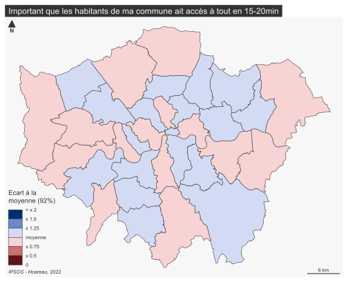


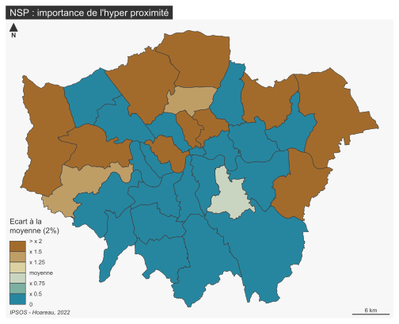 
<div align="justify">Lorem ipsum dolor sit amet, consectetur adipiscing elit, sed do eiusmod tempor incididunt ut labore et dolore magna aliqua. Ut enim ad minim veniam, quis nostrud exercitation ullamco laboris nisi ut aliquip ex ea commodo consequat. Duis aute irure dolor in reprehenderit in voluptate velit esse cillum dolore eu fugiat nulla pariatur. Excepteur sint occaecat cupidatat non proident, sunt in culpa qui officia deserunt mollit anim id est laborum.Lorem ipsum dolor sit amet, consectetur adipiscing elit, sed do eiusmod tempor incididunt ut labore et dolore magna aliqua. Ut enim ad minim veniam, quis nostrud exercitation ullamco laboris nisi ut aliquip ex ea commodo consequat. Duis aute irure dolor in reprehenderit in voluptate velit esse cillum dolore eu fugiat nulla pariatur. Excepteur sint occaecat cupidatat non proident, sunt in culpa qui officia deserunt mollit anim id est laborum.</div>


## Mixité sociale et immigration

Q26
*Immigration from outside of UK*
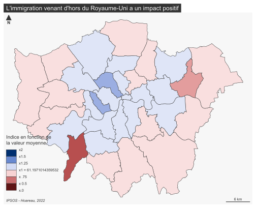
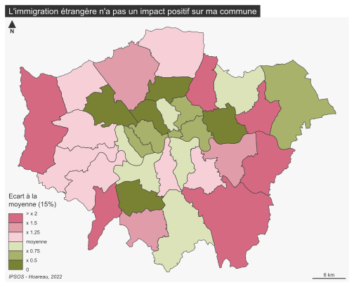
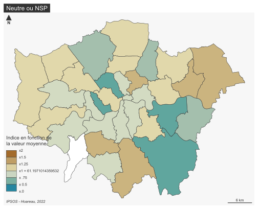
<br>
*Immigration from elsewhere within UK*
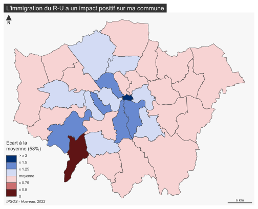
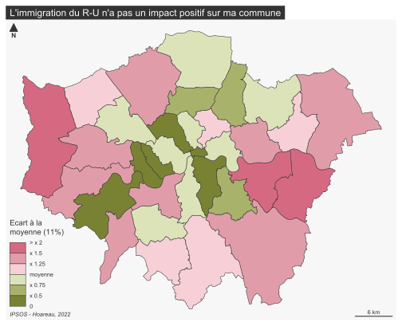
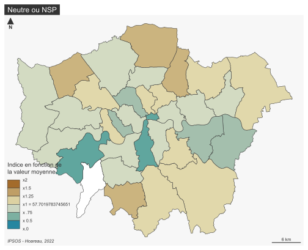
<br>
*I think Londres/Ma commune needs more immigration than the present level*
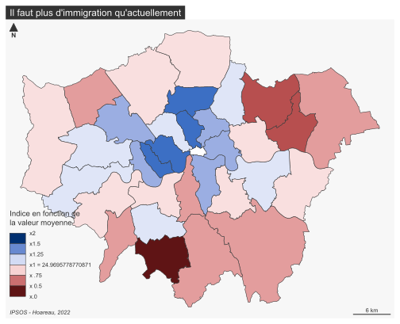
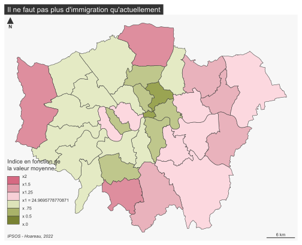
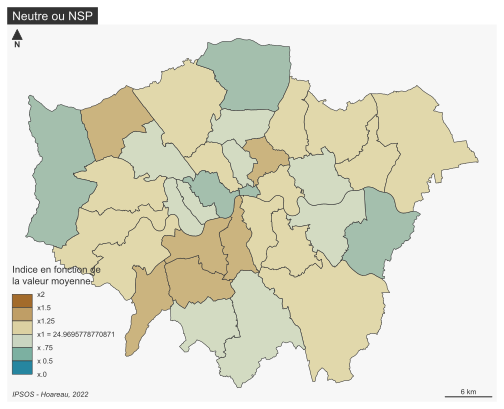

## Sécurité

Q33
*Day*
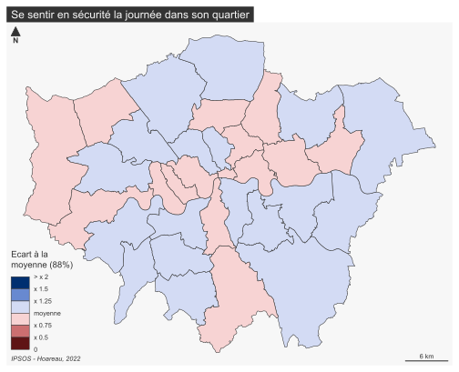


<br>*Night*


## Logement, travail et vie de famille  

***Q11B***
*Bon endroit pour élever ses enfants*
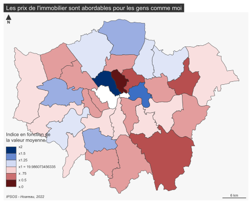
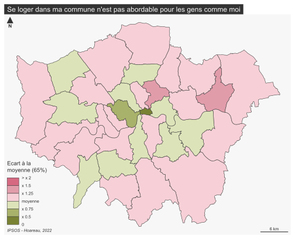
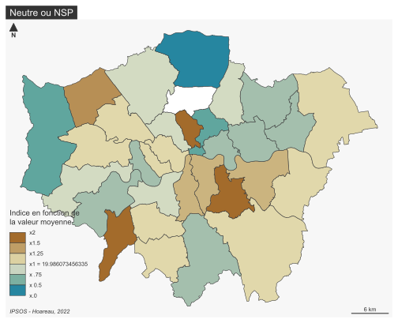
<br>*Immobilier abordable pour les gens comme moi*
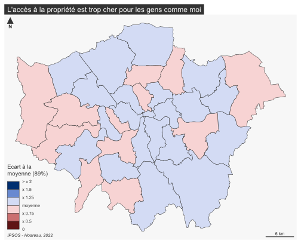
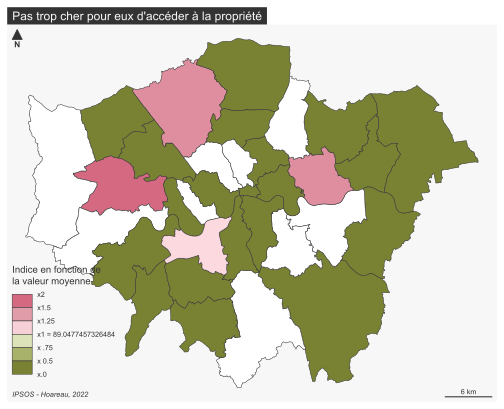
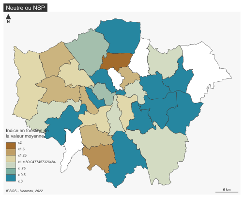
<br>***QD12*** 


## Rebondir après la pandémie

***Q37***
<br>*Transports publics*

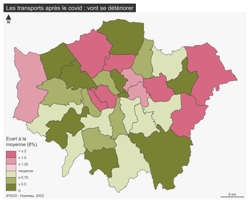

<br> *Afordabilité des logements*

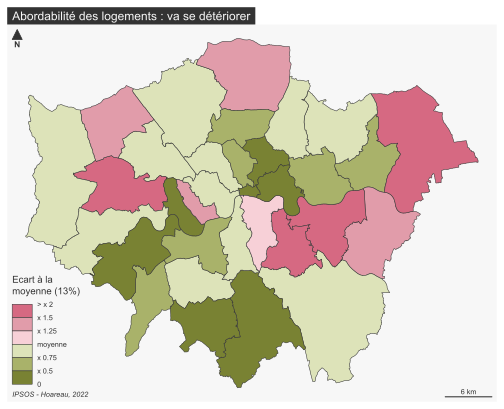
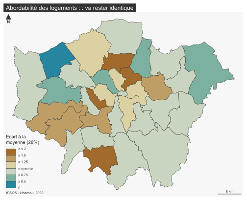
<br> *Opportunités d'emploi*


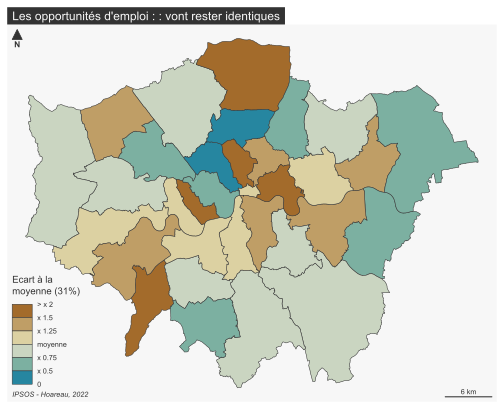
<br> *Niveaux de pollution*
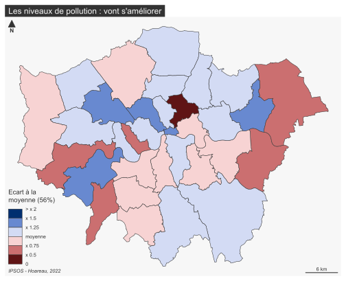
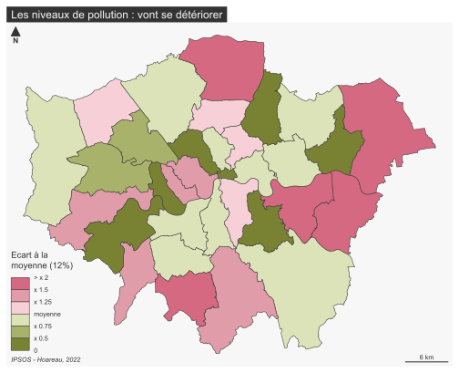
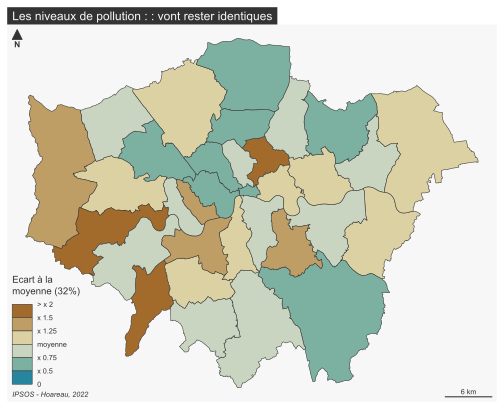
<br> *Hospitalité*

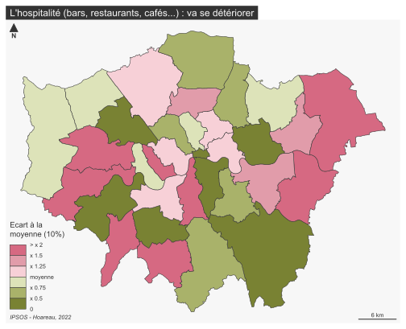

<br> *Cutlure*
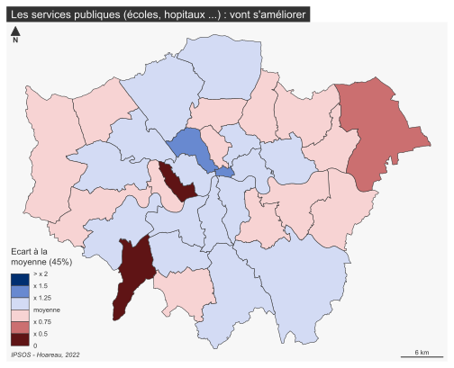


<br> *Services publics*


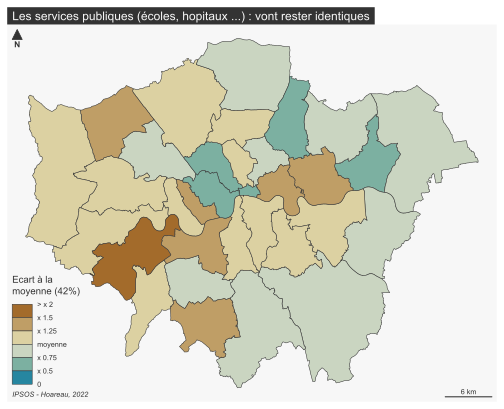


## Préoccupations environnementales  


***Q22B*** 

<br>***Q23***
<br>*Péage urbain*
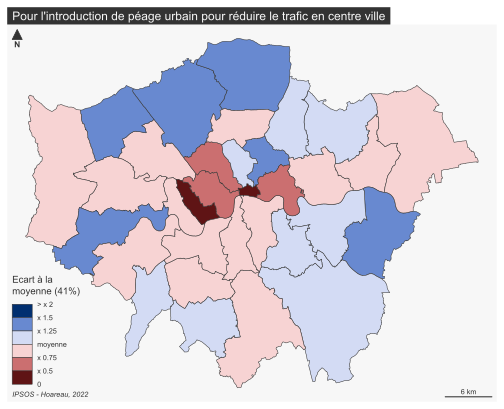
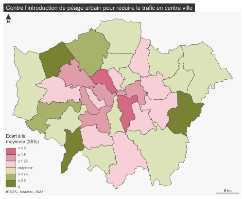
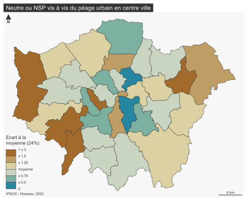
<br>*Plus d'infrastructures cyclistes*

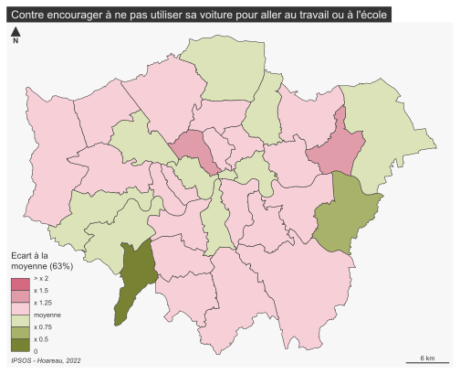

<br>*Plus d'espaces piétons*

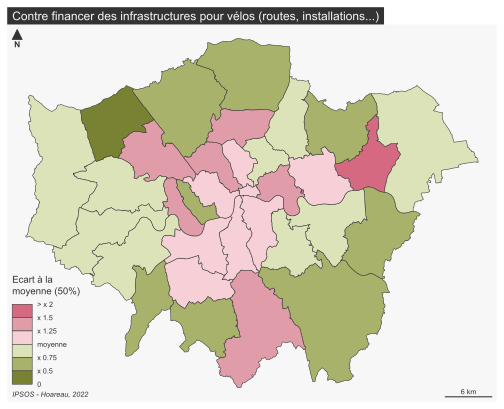

<br>*Journées sans voitures dans Londres*

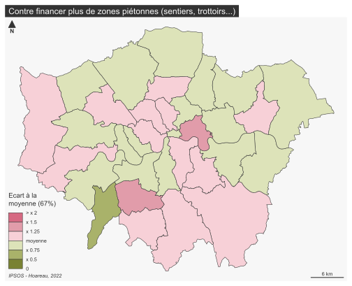

<br>*Centre de Londres réservé aux véhicules propres*

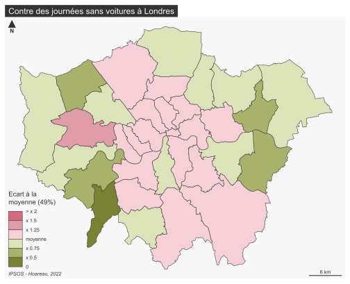

<br>*Réalouer des espaces motorisés aux piétons et vélos*
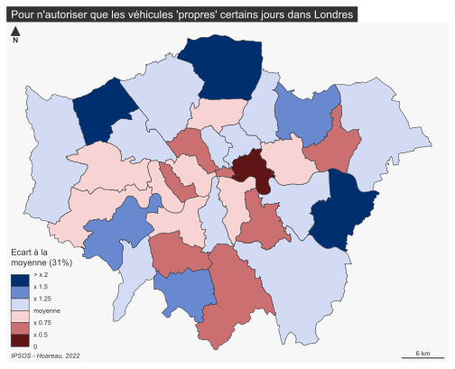


<br>*Réduire la vitesse en zone dense*
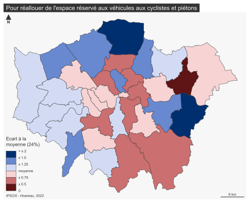

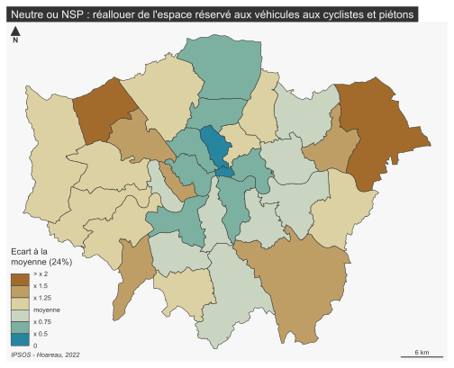

#
<br><a href="#top">Revenir en haut de page</a>