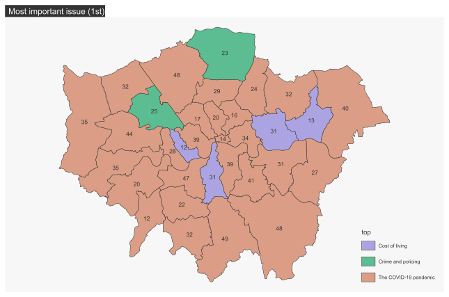
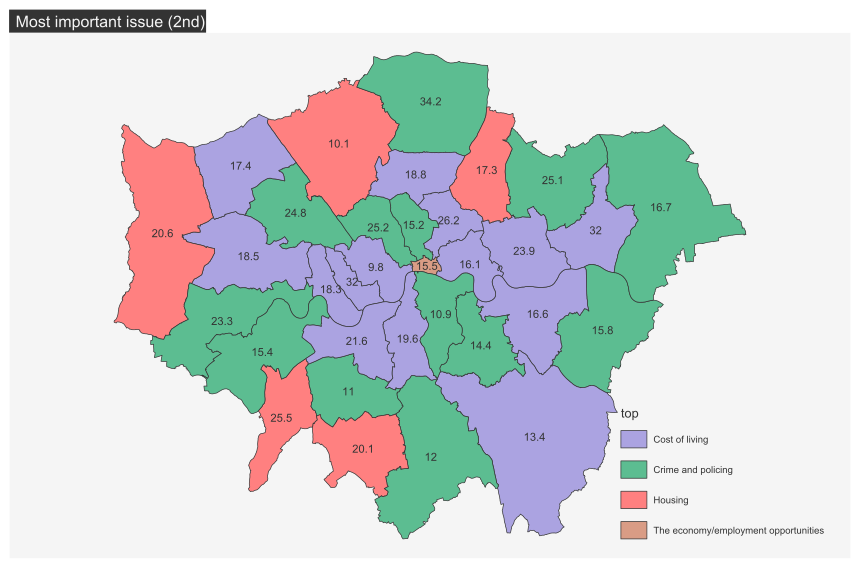

# {.tabset}

   
   
  
## Répondants  
  
 
  
Dans le cas londonien, les répondants ont été réparti de façon à ce cela représente, à quelques exceptions près, à la répartition de la population sur l'ensemble du territoire de la capitale britannique. 
  
   

## Enjeux selon les enquêtés 

 
 
Pour ce qui est des enjeux le plus importants selon les londoniens, sans surprise une grande majorité des Boroughs ont répondu la pandémie de la Covid-19. Cependant, en comparaison avec Paris quelques exceptions se sont glissées sur la carte : le coût de la vie et le crime et le maintien de l'ordre.
   Sur la carte ci-dessous, représentant le deuxième enjeu le plus important, on retrouve pour une grande majorité des cas le coût de la vie et le maintien de l'ordre comme enjeux importants. Sans grande surprise non plus, la City de Londres pense tout particulièrement à l'économie, notamment du fait qu'il s'agisse d'une entité concentrant des fonctions économiques importantes. En périphérie de Londres on remarque que le logement est un des enjeux majeurs pour certains boroughs. 
 
  
   

## La vie dans son quartier pendant la Covid

 

Tout comme la capitale française, Londres présente un important taux de réponse positive quant à la question de l'importance de l'hyperproximité, en effet ***92%*** des répondants pensent qu'il s'agit d'un aspect important dans leur vie. On retrouve alors une certaine homogénéité vis à vis de l'écart à la moyenne pour la première carte, et des résultats plus disparates sur les cartes suivantes, dû notamment au faible nombre d'enquêtés qui sont contre, ou neutre vis à vis de cette importance. 

  <a href="#top">Revenir en haut de page</a>

## Quitter les grandes villes après le Covid ?

***Q14A : How likely, if at all, is it that you will move out of Paris/votre commune in the next five years?***
 

***56%*** des enquêtes ont répondu qu'ils ne comptaient pas quitter Londres, contre ***28%*** qui sont certains ou presque de vouloir quitter la ville. On peut conclure qu'une majorité des répondants est donc satisfaite de son cadre de vie, ou bien qu'ils sont attachés à ce dernier.  
Dans le cas de cette question, la carte des répondants voulant rester à Londres est intéressante. En effet, on remarque une sorte de clivage entre l'est et l'ouest de la ville, avec quelques exceptions comme le borough d'Havering, qui présente, sur le papier, des aspects favorisant une bonne qualité de vie (chômage faible, espaces verts très présent du fait de la *Metropolitan Green Belt*).

## Mixité sociale et immigration

Q26
**Immigration from outside of UK**

Pour une grande majorité (***61%***) des enquêtés, l'immigration venant de l'étranger a un impact positif sur leur ville. On remarque surtout que sur la carte des réponses positives, une différence entre le centre, plus favorable à l'immigration, et la périphérie qui l'est moins. Avec le borough Kingston upon Thames qui semble plus défavorable, ou plus neutre, vis à vis de cette question

 
**Immigration from elsewhere within UK**

L'immigration venant d'ailleurs au Royaume-Uni est légèrement moins acceptée dans l'ensemble (***58%***), mais l'on retrouve une différence entre le centre et la périphérie, avec tout de même davantage de boroughs qui présentent un indice négatif. Kingston upon Thames est également en désaccord avec l'impact positif qu'a cette immigration.

 
**I think Londres/Ma commune needs more immigration than the present level**

A la question de savoir si il faut plus d'immigration, on retrouve environ un tier des répondants partout, avec légèrement plus de réponses neutres et négatives. Il est intéressant d'observer un autre clivage est-ouest pour la carte des réponses négatives.

## Sécurité
**Day**
 

***88%*** des répondants se sentent en sécurité dans leur quartier en journée. Cartographiquement, cela fait que les écarts à la moyenne sont faibles sur l'ensemble de l'espace étudié, on peut dire que la situation est assez homogène.

 

 
**Night**
 

La nuit, les répondants se sentant en sécurité tombent à ***59%*** et la situation devient moins homogène. ***19%*** ne se sentent pas en sécurité, et on retrouve ce sentiment davantage à l'ouest et au centre-est qu'à l'est ou dans le centre de Londres.

## Logement, travail et vie de famille  

***Logement***
 
**Se loger est abordable**
 

***65%*** des enquêtés pensent que se loger est trop cher pour eux, contre ***20%*** pour le constat inverse. La city et quelques boroughs les plus au centre de Londres semblent davantage en capacité de se loger que le reste du territoire londonnien, notamment le sud-est de la ville et les boroughs les plus pauvres du centre (Isilington et Hackney).

 
**L'accès à la propriété est abordable pour les gens comme moi**
 

Pour l'accès à la propriété, la réponse est assez homogêne sur l'ensemble du territoire puisque ***89%*** des répondants pensent que ce coup est trop élevé.

 ***Télétravail*** 

A Londres, une majorité (***54%***) des répondants ont la possibilité de télétravailler, et ***21%*** n'en n'ont pas la possibilité. L'inner-Londres semble plus apte à télétravailler que le reste du territoire étudié.

## Rebondir après la pandémie

 **Transports publics**

***Environ 45%*** des répondants sont soient optimistes ou neutres vis à vis de l'avenir des transports publics au sein de la capitale anglaise. La partie centrale et l'ouest de l'inner Londres sont davantages optimistes que la périphérie de Londres intérieur. Pour les boroughs les plus éloignés, la situation est plus hétérogène.

  
**Abordabilité des logements**
 

Comme vu dans la partie sur le logement, Londres est une ville chère, cependant ***60%*** des répondants pensent que cette situation va s'améliorer dans les cinq prochaines années. Spatialement, on observer une certaine homogénéité puisque la quasi-totalité des boroughs sont proches de la moyenne générale.
Seul le borough de Hammersmith and Fulham semble tendre vers plus de pessimisme vis à vis de cette question.

  
**Opportunités d'emploi**
 

Cette question de l'emploi observe également des réponses plutôt optimistes puisque ***55%*** des répondants sont optimistes, contre seulement ***14%*** de réponses pessimistes. On retrouve cependant certains boroughs à l'est et au sud de l'inner-Londres qui tendent vers moins d'optimisme que le reste des boroughs. 

  
**Niveaux de pollution**
 

***56*** des personnes pensent que les niveaux de pollutions vont s'améliorer. Hormis les boroughs de Hackney et Kesington and Chelsea, l'Inner-Londres est assez optimiste quant à cette question. Et une grande partie des boroughs en périphérie pensent que la situation va se détériorer ou rester identique.

  
**Cutlure**
 

Hormis certains boroughs les plus excentrés à l'ouest et surtout à l'est, une grande partie des boroughs tendent à un optimiste ou à une vision neutre sur l'avenir de la culture.

  
**Services publics**
 

Pour la question de l'avenir des services publics, près de la moitié pensent que ces derniers vont s'améliorer et seulement ***12%*** pensent qu'ils vont se détériorer. On retrouve les boroughs de l'est qui semblent plutôt pessimistes vis à vis de cette question, davantage qu'à l'ouest qui tend plus vers une stagnation des services publics. La city reste elle très optimiste vis à vis de cette question

 

Le pessimisme est peu présent sur le territoire londonnien si on le prend dans sa globalité. Cependant, on remarque que les boroughs à l'est semble plus enclin à un sentiment pessimiste vis à vis des thématiques abordées. *A contrario*, la city reste un borough optimiste en toutes circonstances. On ne dessine pas d'opposition inner / outer Londres pour la question de l'optimisme générale.

 <a href="#top">Revenir en haut de page</a>