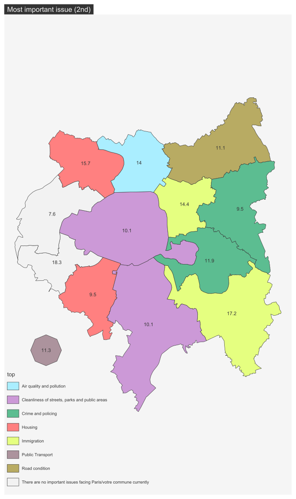
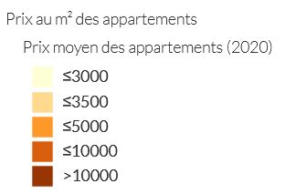

#  {.tabset}

    

## Répondants

\

::: {align="justify"}
Ci-dessus, on retrouve la répartition des répondants selon la commune
dans lesquels ces derniers habitent. Plusieurs constats peuvent alors
être soulevés. D'une part, il est important de souligner que pour la
Ville de Paris, aucune information sur les arrondissements n'est
présentée. De plus, on remarque que l'espace d'étude ne se résume pas
uniquement aux limites du Grand Paris mais présente des communes de la
Grande Couronne de l'Île-de-France. Enfin, hormis pour la Ville de
Paris, on peut se dire qu'une analyse à l'échelle de la commune ne
serait pas pertinent, notamment du fait du faible nombre d'enquêtés à
cette échelle. Afin de pouvoir apporter une analyse géographique plus
cohérente, le choix a donc été fait d'agréger les enquêtés en fonction
des Établissements Publics Territoriaux (EPT) du Grand Paris et de
regrouper les communes hors de ce dernier dans un seul polygone pour une
certaine cohérence graphique.
:::

   

::: {align="justify"}
Pour la répartition des répondants, elle est assez inégale d'un point de
vue spatial, notamment du fait que la moitié des répondants soient à
Paris et que le reste des 502 répondants sont répartis entre les 12
entités restantes. Cependant, au vue de la population de chaque EPT cela
reflète relativement une répartition effective des répondants à
l'enquête.
:::

 

<a href="#top">Revenir en haut de page</a>

## Enjeux selon les enquêtés

#### ***"Q1A. What would you say is the most important issue facing Paris/votre commune today?"***

::: {align="justify"}
Le principal enjeu pour l'ensemble des EPT est la Covid-19. Afin d'aller
un peu plus loin pour cette question, il est alors intéressant de
regarder la 2è réponse la plus choisie selon les EPT. On se retrouve
alors avec une plus grande hétérogénéité dans les réponses, et cela
malgré le faible nombre d'objets géographiques en présence (13 pour 8
réponses différentes).

<https://www.20minutes.fr/planete/3266779-20220406-pollution-la-qualite-de-l-air-pres-des-autoroutes-de-seine-saint-denis-est-toujours-tres-mauvaise>

:   Plaine Commune & qualité de l'air : présence de grands axes routiers

<https://www.francetvinfo.fr/sante/pourquoi-paris-est-elle-toujours-si-sale_4765243.html>

:   Paris réputation ville sale, on retrouve ce constat avec la carte
    ci-dessous puisqu'il s'agit du 2e enjeu le plus cité par les
    enquêtés de Paris *intra-muros*.
:::

<a href="#top">Revenir en haut de page</a>

## La vie dans son quartier pendant la Covid

#### ***"Q22A. How important, if at all, do you think it is that people living in Paris/votre commune have access to all of the local facilities they need within their local area, that is the area within 15-20 minutes' walking distance from their home?"***  

::: {align="justify"}
Cette question, se refère à la question de l'**hyper-proximité** (avoir
accès à tous les services essentiels a moins de 20 min à pied de son
domicile). Selon l'enquête réalisée sur le sol francilien, une très
grande majorité des enquêtés pensent que cette notion est importante.
Ils sont en effet **90%** à penser cela, contre **7%** à penser le
contraire.
:::

  

::: {align="justify"}
La carte ci-dessus tend à prouver une certaine homogénéité territoriale
pour l'importance de l'hyper proximité puisqu'en effet, l'ensemble des
EPT ont une valeur proche de la moyenne de l'espace étudié. Les deux
cartes ci-dessous montrent les résultats obtenus pour l'indiférence ou
la non importance de cette question. On retrouve alors de gros écarts
entre certains EPT, causés principalement par le faible nombre de
répondants qui accentue l'effet "d'extrême". Parler du fait que le covid
et les confinements ont fait qu'on devait vivre a 1km de chez soi,
renforcer ce sentiment d'avoir tout à proximité (cf. IPR)
:::

::: row
::: {.col-md-6 markdown="1"}

:::

::: {.col-md-6 markdown="1"}

:::
:::

<a href="#top">Revenir en haut de page</a>

## Quitter les grandes villes après le Covid ?

#### ***"Q14A. How likely, if at all, is it that you will move out of Paris/votre commune in the next five years?"***  

::: {align="justify"}
<https://www.institutparisregion.fr/nos-travaux/publications/conditions-de-vie-et-aspirations-des-franciliens-en-2021/>
:::

 
  

<a href="#top">Revenir en haut de page</a>

## Immigration

::: {align="justify"}
Cette partie traitera des questions migratoires dans le Grand Paris.
:::

 

#### *"**Q26. Thinking now about immigration to Paris/votre commune, to what extent do you agree or disagree with the following statements? -** Immigration from outside of France has had a positive impact on Paris/Ma commune"*  

::: {align="justify"}
Pour la question de l'impact positif qu'a l'immigration venant d'hors de
France, on retrouve environ un tier des répondants pour les réponses
proposées (les réponses "Neutre" et "Ne sait pas" ont été rassamblées
pour faciliter la lecture).
:::

  

  

  

::: {align="justify"}
Avec ces trois cartes, on remarque principalement que Paris, les
communes hors du grand paris et l'EPT Boucle Nord Seine sont assez
convaincu par le fait que l'immigration venant de l'étranger a un impact
positif. *A contrario*, l'EPT Grand Sud Est Avenir, semblent contre
cette idée. Les EPT Grand Orly Seine Bièvre et Paris-Marne-Est et Bois
tendent a plus de neutralité vis-à-vis de cette question.
:::

 

#### *"... Immigration from elsewhere within France has had a positive impact on Paris/Ma commune"*

 

::: {align="justify"}
Pour la question de l'impact positif qu'a l'immigration venant
d'ailleurs en France, environ la moitié des répondants sont neutres ou
ne savent pas (**48%**), un tier (**34%**) pensent qu'elle a un impact
positif, et le reste (**18%**) pensent le contraire.
:::

   

::: {align="justify"}
On peut soulever le fait que la Ville de Paris reste assez neutre quant
à cette question mais tend à dire que l'immigration venant d'ailleurs en
France a un impact positif.Les EPT situés au Nord, au Nord-Ouest et à
l'Est du territoire du Grand Paris semblent quant à eux plutôt en
désaccord avec cette idée.
:::

 

#### *"I think Paris/Ma commune needs more immigration than the present level"*

::: {align="justify"}
Pour cette question, une majorité des répondants (**52%**) pensent qu'il
ne faut pas plus d'immigration dans leur commune. A l'opposé, seulement
**15%** des enquêtés pensent qu'il faut plus d'immigration dans leur
commune.
:::

   

::: {align="justify"}
Les EPT à l'ouest de Paris et l'EPT Grand Paris Sud Est Avenir tendent à
confirmer la tendance général puisqu'ils sont clairement en défaveur
d'une augmentation de l'immigration. *A contrario*, les EPT Est
Ensemble, Boucle Nord de Seine et les communes hors du Grand Paris
pensent assez nettement qu'il faut plus d'immigration. Le reste des EPT
semblent être assez neutre à cette question, ou du moins présentent un
équilibre entre les réponses positives, neutres et négatives.
:::

 

<a href="#top">Revenir en haut de page</a>

## Sécurité

#### ***"Q33. How safe do you feel walking alone in your local area...*** *Day**"***

::: {align="justify"}
L'immense majorité des répondants se sentent en sécurité la journée dans
leur quartier. Avec les cartes présentés ci-dessous on note cependant
que l'EPT Plaine Commune présente une immense majorité de réponses
négatives.
:::

####       

#### *... at Night"*

::: {align="justify"}
En opposition avec la journée, on retrouve une perte du sentiment de
sécurité la nuit dans les quartiers des répondants puisqu'on passe de
**84%** en journée à **52%** la nuit. On retrouve cependant le sentiment
d'insécurité à Plaine Commune et à Est Ensemble. Les EPT de l'Ouest se
sentent quant à eux davantage en sécurité en comparaison avec l'ensemble
de l'espace étudié (là où il y avait une relative homogénéité en
journée).
:::

   
 <a href="#top">Revenir en haut de
page</a>

## Logement, travail et vie de famille

::: {align="center"}
|                     |                            |
|:-------------------:|:--------------------------:|
|  |  |
:::

::: {align="center"}
~Figure 1 : Prix moyen au m² des appartements (2020) en IDF~

~Source : cartoviz.institutparisregion.fr~
:::

::: {align="justify"}
La figure 1 est présentée dans le but d'apporter quelques éléments de
compréhension quant aux résultats qui seront présentés ci-dessous. Elle
montre le prix moyen au m² des **appartements** en 2020. Pour donner
deux exemples de lecture, la Ville de Paris (le plus cher) possède un
prix au m² moyen d'environ 11 000 € et l'EPT Paris Terres d'Envol (le
moins cher) d'environ 2 900 €.
:::

#### \*\*\*"Q11B. Thinking now about living in Paris/votre commune, to what extent do you agree or disagree with the following statements?\*\*\* - ***L'immobilier dans ma commune est abordable pour les gens comme moi*** ."

####  

::: {align="justify"}
Une majorité des répondants (**52%**) pensent que leur commune n'offre
pas des logements abordables pour les gens partageant le même profil
qu'eux. Ce sentiment est légèrement plus présent au sein de la Ville de
Paris et les EPT Boucle Nord de Seine, Est Ensemble et Grand Paris Seine
Ouest. *A contrario* l'EPT Grand Paris Sud Est Avenir et les communes
hors du Grand Paris ont davantage le sentiment que leur commune est
abordable pour les gens comme eux.
:::

####     "....*L'accès à la propriété est trop cher pour les gens comme moi"*  

::: {align="justify"}
La question de l'accès à la propriété a un résultat plus tranché puisque
**76%** des répondants pensent qu'il est trop cher selon leur profil. Il
s'agit d'un sentiment qu'on retrouve unanimement sur le territoire de
l'enquête puisque l'ensemble des EPT, à l'exception des communes Hors du
Grand Paris, présentent des résultats proche de la moyenne de l'espace
d'étude. Les répondants hors du Grand Paris semblent même dire que
l'accès à la propriété est abordable pour les gens comme eux. Un
sentiment logique compte tenu de prix de l'immobilier inférieur qu'en
petite couronne.
:::

 
  

#### ***"QD12. Which of these best describes your current working arrangements?"***

####   

::: {align="justify"}
Si le télétravail est une pratique de plus en plus courante, tout le
monde n'est pas mis sur même un pied d'égalité vis à vis de cette
pratique, notamment du fait de la vie de famille ou de la disposition
des logements. Parmi l'ensemble des répondants, ***40%*** ont la
possibilité de travailler depuis chez eux. *A contrario*, ***21%*** ne
peuvent pas être en télétravail. Géographiquement parlant, le constat
est net : les EPT au Nord du Grand Paris ont moins la capacité de
télétravailler que le reste du territoire, notamment Paris, les communes
Hors du Grand Paris et les EPT de l'Ouest. En prenant l'exemple de l'EPT
Plaine Commune, majoritairement composé de communes populaires
(Ribardière 2018), les ménages travaillent en tant qu'ouvriers et
employés, or il s'agit de professions n'offrant pas la plupart du temps
la possiblité de télétravailler. On peut également penser qu'à cela
s'ajoute la composition du foyer (familles nombreuses ou monoparentales
dans des logements non-adaptés). Il faut également noter la présence
marquée sur la première carte de l'EPT Grand Paris Sud Est Avenir qui
peut être interprêté comme un espace où l'on ne télétravaille pas, alors
qu'il s'agit plutôt d'un espace où les enquêtés ne travaillent pas (ou
sont en congés).
<https://www.institutparisregion.fr/nos-travaux/publications/conditions-de-vie-et-aspirations-des-franciliens-en-2021/>
:::

<a href="#top">Revenir en haut de page</a>

## Rebondir après la pandémie

::: {align="justify"}
Cette série de question a pour objectif de montrer l'optimisme des
parisiens après la pandémie vis à vis de différentes thématiques.
:::

#### ***"Q37. Thinking about Paris/Paris et sa région in the next few years after the coronavirus pandemic, do you think each of the following will get better, get worse, or stay the same? ..."***

####  *Transports publics*  

::: {align="justify"}
Pour ce qui est des transports publics, **45%** des répondants pensent
que la situation va rester identique après la pandémie, **35%** qu'elle
va s'améliorer, et **20%** qu'elle va se détériorer.
:::

  

::: {align="justify"}
Il est important de soulever que les EPT à l'ouest, au sud ouest et au
sud semblent davantage optimistes vis à vis des transports publics, un
sentiment qui peut, peut-être, se justifier par le Grand Paris Express
et un meilleur accueil de ce dernier dans cette zone plutôt qu'au nord
et à l'est de la capitale. Il faut également préciser que le nombre de
répondants étant assez faible vis à vis de la population générale du
Grand Paris, il est difficile de mesurer l'impact positif ou négatif du
GPE du fait de l'éparpillement des répondants.
:::

####     *Abordabilité des logements*  

::: {align="justify"}
Contrairement aux transports, **55%** des répondants pensent que
l'abordabilité des logements va se détériorer dans le futur, et
seulement **12%** des enquêtes sont optimistes. Ce qui flagrant est le
grand pessimisme et le très faible optimiste que l'EPT Grand-Orly Seine
Bièvre, en opposition avec Paris Ouest La Défense ou l'Hors Grand Paris.
:::

####      *Opportunités d'emploi* 

::: {align="justify"}
On retrouve environ 1/3 des répondants pour chaque réponse vis à vis de
l'avenir des opportunités d'emploi, avec un pessimisme légèrement plus
présent (***26%***). La Ville de Paris et les EPT du Nord semblent plus
tendre vers un optimisme, contrairement au Sud, est surtout à l'Est, qui
sont plus pessimistes vis à vis de cette question. On peut transposer
cette logique avec les nombreux travaux encourageant le développement
économique au nord et aux alentours de la Défense
:::

####      *Niveaux de pollution*  

::: {align="justify"}
La question de la gestion des niveaux de pollution est au coeur des
politiques des villes aujourd'hui. Pourtant, seulement ***18%*** de
l'ensemble des enquêtés semblent optimistes vis à vis de cette question.
La ville de Paris semble d'ailleurs particulièrement optimiste,
contrairement aux EPT présents au Sud et à l'extrême est du Grand Paris.
:::

####   *Cutlure*  

::: {align="justify"}
Si ***41%*** des répondants pensent que la situation des lieux de
cultures va rester identiques, ***35%*** pensent qu'elle va s'améliorer
et ***24%*** pensent qu'elle va se détériorer dans les prochaines
années. La Ville de Paris présente d'ailleurs des résultats proches de
la moyenne dans toutes les réponses possibles, comme une majorité d'EPT.
:::

####      *Services publics*  

::: {align="justify"}
***1/3*** des répondants pensent que les services publics vont se
détériorer, un sentiment particulièrement présent à l'est du Grand
Paris. Il est intéressant de préciser que l'EPT Grand Paris Seine Ouest
possède à la fois une grande part de répondants optimistes et
pessimistes. Au nord, les EPT tendent à dire que les services vont
rester à l'identique. Le terme "services publics" étant assez large, il
aurait peut être fallu différencier les services publics (notamment
accès à la santé mis à mal par la crise Covid), et pourquoi pas en faire
une catégorie de question à part entière.
:::

::: {align="justify"}
Dans l'ensemble, la Ville de Paris semble assez optimiste vis à vis de
l'avenir, tout comme les EPT présents à l'Ouest (qui ont pour réputation
d'accueillir une population plus aisée). Le reste du territoire
francilien présente davantage de contrastes, mais dans l'ensemble un
optimiste général semble se dessiner. Certains EPT offrent davantage de
réponses pessimistes, on peut citer l'exemple de l'EPT Grand-Orly Seine
Bièvre notamment.
:::

<a href="#top">Revenir en haut de page</a>

)
